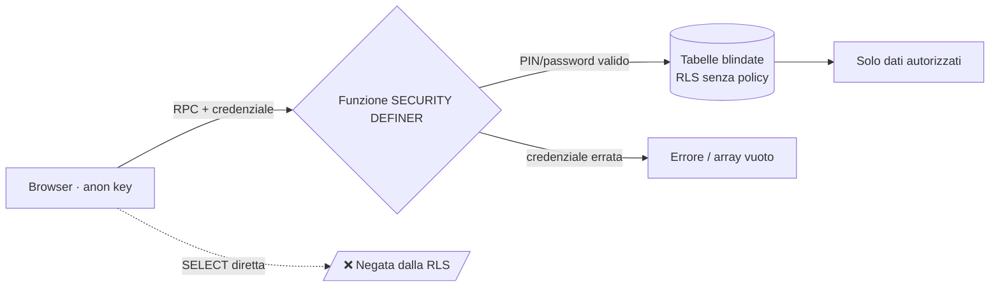
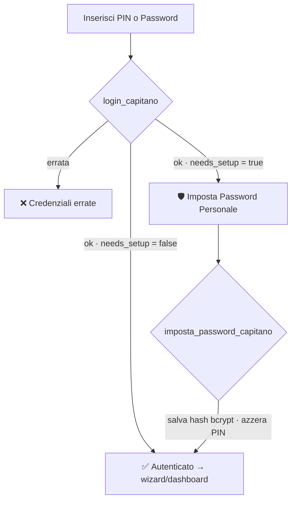

<div align="center">

# 🏆 Fanta GSF — *Summer Games*

### Il fantasy game gamificato per le 5 serate dei **GSF Summer Games**

I capitani piazzano le loro scommesse sulle azioni dei giudici, la regia le valida in tempo reale,
la classifica si aggiorna da sola… e a fine evento il **Svelamento Finale** rivela tutti i segreti. 🎭

<br/>


</div>

---

## 📑 Indice

- [Cos'è Fanta GSF](#-cosè-fanta-gsf)
- [Funzionalità](#-funzionalità)
- [Stack tecnologico](#-stack-tecnologico)
- [Mappa delle rotte](#-mappa-delle-rotte)
- [Architettura & Sicurezza (Zero-Trust)](#-architettura--sicurezza-zero-trust)
- [Autenticazione](#-autenticazione)
- [Svelamento Finale](#-svelamento-finale)
- [Struttura del progetto](#-struttura-del-progetto)
- [Database & RPC](#-database--rpc)
- [Setup & avvio](#-setup--avvio)
- [Comandi disponibili](#-comandi-disponibili)
- [Configurazione iniziale](#-configurazione-iniziale)

---

## 🎯 Cos'è Fanta GSF

Fanta GSF è una **web app one-shot** pensata per un evento di **5 serate consecutive**. Ogni serata:

1. Il **capitano** di ogni squadra accede, sceglie un **giudice** e indovina che **azione** farà, scommettendo punti **bonus** (`+`) o **malus** (`-`).
2. La **regia** (staff), da un pannello protetto, valida ogni scommessa come ✅ *indovinata* o ❌ *fallita*.
3. La **classifica generale** si ricalcola automaticamente dalle scommesse validate.
4. A fine evento, la regia attiva lo **Svelamento Finale**: una schermata pubblica e spettacolare che mostra a tutti lo storico completo.

Vincolo chiave: **una sola scommessa per squadra per serata** (`UNIQUE(squadra_id, num_serata)`), e si può scommettere **solo per la serata in corso**.

---

## ✨ Funzionalità

| Area | Cosa fa |
|------|---------|
| 🧑‍✈️ **App Capitano** | Login, selezione squadra, wizard a step per piazzare la scommessa della serata, dashboard personale read-only. |
| 🔐 **Password personale** | Primo accesso con PIN/OTP → il capitano imposta una **password personale** salvata come **hash bcrypt**. |
| 🎬 **Area Staff (Regia)** | Login con PIN, validazione scommesse (✅/❌/reset), controllo serata corrente (data + override), **Master Switch** dello Svelamento. |
| 📅 **Serata corrente** | Modello ibrido: calcolo automatico per data (apertura ore 10:00 *Europe/Rome*) con possibilità di **override manuale** per ritardi/rinvii. |
| 🏆 **Classifica pubblica** | Podio + ranking completo, aggiornata dalle scommesse validate. |
| 🎭 **Svelamento Finale** | Schermata "gran finale" sbloccabile dalla regia, con raggruppamento per Squadra o per Serata. |

---

## 🧱 Stack tecnologico

- **Frontend:** React 19 + Vite 8 (HMR, build ultraveloce)
- **Styling:** Tailwind CSS **v4** (via `@tailwindcss/postcss`) — stile morbido, colorato, gamificato (`rounded-2xl`, gradienti, `shadow-lg`)
- **Icone:** `lucide-react`
- **Backend:** Supabase (Postgres) — accesso **esclusivamente via RPC** `SECURITY DEFINER`
- **Crypto:** estensione `pgcrypto` (bcrypt) per l'hashing delle password
- **Routing:** hash-based, senza dipendenze esterne (`window.location.hash`)

---

## 🗺️ Mappa delle rotte

Il routing è basato sull'hash dell'URL (nessuna libreria di routing).

| Rotta | Schermata | Accesso |
|-------|-----------|---------|
| `#/` *(o qualsiasi altro)* | App Capitano (login → wizard / dashboard) | Login capitano |
| `#/staff` | Pannello Regia | PIN staff |
| `#/classifica` | Classifica generale | 🌐 Pubblico |
| `#/svelamento` | Svelamento Finale | 🌐 Pubblico *(gated dal flag server-side)* |

---

## 🏗️ Architettura & Sicurezza (Zero-Trust)

> **Principio:** la `anon key` di Supabase **non può leggere nulla di sensibile in chiaro**. Ogni lettura/scrittura passa per funzioni Postgres `SECURITY DEFINER` che validano una credenziale (PIN o password) **ad ogni chiamata**. Niente sessioni, niente token persistenti.



**Cosa è blindato:**
- `staff_config` (PIN regia), `config_evento` → RLS abilitata **senza policy** = invisibili via API.
- `scommesse_del_capitano` → `INSERT` consentito ad `anon` (i capitani scommettono), ma **nessuna policy SELECT**: le letture passano solo da RPC che verificano la credenziale.
- `squadre.pin_accesso` / `squadre.password_hash` → mai esposti; verificati solo lato server.

---

## 🔐 Autenticazione

### 🧑‍✈️ Capitani — flusso a due fasi (PIN → Password personale)

Il `pin_accesso` funge da **Codice di Primo Accesso (OTP usa-e-getta)**. Al primo login il capitano imposta una **password personale**, salvata come **hash bcrypt** (`pgcrypto`, schema `extensions`). Da lì in poi accede con la sua password e il PIN viene azzerato.



### 🎬 Staff — PIN regia

Login con PIN verificato contro `staff_config(chiave = 'pin_regia')`. Il PIN viene richiesto **ad ogni azione** sensibile (validazione, reset, config serata, svelamento): zero-trust puro.

---

## 🎭 Svelamento Finale

A fine evento la regia attiva lo **Svelamento** dal Master Switch in Area Staff.

- **Sigillato** (`svelamento_attivo = false`): `get_scommesse_svelamento()` restituisce un **array vuoto**. La schermata pubblica mostra una UI d'attesa drammatica (lucchetto gigante + finto terminale *"La regia non ha ancora sbloccato i segreti…"*).
- **Sbloccato** (`svelamento_attivo = true`): la schermata rivela **tutte** le scommesse di tutte le squadre, raggruppabili **Per Squadra** (leaderboard con corona) o **Per Serata**, con esiti, punti e icone.

🔆 **Bonus UX:** quando lo svelamento è attivo, il bottone 👁️ nell'header dell'app si illumina con un glow `animate-pulse`.

---

## 📁 Struttura del progetto

```
fanta-gsf/
├─ src/
│  ├─ App.jsx                      # Routing hash, header, orchestrazione stato & wizard
│  ├─ supabaseClient.js            # Init client Supabase (URL + anon key da .env)
│  └─ components/
│     ├─ Step1Squadra.jsx          # Login capitano (PIN→password) + selezione squadra
│     ├─ Step2Calendario.jsx       # Calendario delle 5 serate
│     ├─ Step3Scommesse.jsx        # Wizard di piazzamento scommessa
│     ├─ AnteprimaSidebar.jsx      # Anteprima live + submit finale
│     ├─ DashboardCapitano.jsx     # Dashboard read-only del capitano
│     ├─ AreaStaff.jsx             # Pannello Regia (validazioni, serata, svelamento)
│     ├─ Classifica.jsx            # Classifica pubblica (podio + ranking)
│     ├─ SvelamentoFinale.jsx      # Schermata "gran finale"
│     └─ LogoGSF.jsx               # Logo
├─ supabase_*.sql                  # Script DB da eseguire nel SQL Editor (vedi sotto)
├─ .env                            # VITE_SUPABASE_URL / VITE_SUPABASE_ANON_KEY
└─ tailwind.config.js · vite.config.js · postcss.config.js
```

---

## 🗄️ Database & RPC

### Script SQL — eseguili nel **SQL Editor di Supabase** in quest'ordine

> ⚠️ Gli script vanno lanciati a mano (non c'è Supabase CLI/migrations). Sono **idempotenti** (`IF NOT EXISTS`, `CREATE OR REPLACE`, `DROP … IF EXISTS`): puoi rilanciarli senza rischi.

| # | File | Contenuto |
|---|------|-----------|
| 1 | `supabase_cataloghi.sql` | Tabelle e dati base: `giudici`, `squadre`, `catalogo_serate_giochi`, `catalogo_bonus_malus`. |
| 2 | `supabase_scommesse_serate.sql` | Tabella `scommesse_del_capitano` e vincoli serata. |
| 3 | `supabase_serata_corrente.sql` | Singleton `config_evento` + `get_serata_corrente()` / `set_config_serata()`. |
| 4 | `supabase_rls_staff.sql` | `staff_config` (PIN regia), RLS, `verifica_pin_staff`, `valida_scommessa`, `reset_scommessa`. |
| 5 | `supabase_auth_capitani.sql` | Colonna `pin_accesso` + prima versione di `login_capitano`. |
| 6 | `supabase_lockdown_scommesse.sql` | Chiude le letture dirette; `get_scommesse_staff`, `get_scommesse_squadra`. |
| 7 | `supabase_classifica.sql` | Vista `classifica_generale` (punti aggregati). |
| 8 | `supabase_password_capitani.sql` | `pgcrypto`, `password_hash`, login a due fasi, `imposta_password_capitano`. |
| 9 | `supabase_svelamento_finale.sql` | Flag `svelamento_attivo` + `toggle_svelamento` / `get_stato_svelamento` / `get_scommesse_svelamento`. |

### RPC esposte

| Funzione | Scopo | Auth |
|----------|-------|------|
| `get_serata_corrente()` | Serata attualmente aperta (o `null`). | 🌐 |
| `login_capitano(p_squadra_id, p_secret)` | Login; ritorna `needs_setup` per il primo accesso. | PIN/password |
| `imposta_password_capitano(p_squadra_id, p_old_pin, p_nuova_password)` | Scambia l'OTP con la password personale (bcrypt). | PIN |
| `get_scommesse_squadra(p_squadra_id, p_secret)` | Scommesse della squadra (dashboard). | PIN/password |
| `verifica_pin_staff(p_pin)` | Login regia. | PIN staff |
| `get_scommesse_staff(p_pin)` | Tutte le scommesse (pannello regia). | PIN staff |
| `valida_scommessa(p_scommessa_id, p_indovinata, p_pin)` | Segna ✅/❌. | PIN staff |
| `reset_scommessa(p_scommessa_id, p_pin)` | Rimette in attesa. | PIN staff |
| `set_config_serata(p_pin, p_data_inizio, p_serata_override)` | Configura la serata corrente. | PIN staff |
| `toggle_svelamento(p_pin, p_stato)` | Attiva/disattiva lo Svelamento. | PIN staff |
| `get_stato_svelamento()` | Solo il flag (glow header / stato pannello). | 🌐 |
| `get_scommesse_svelamento()` | Storico completo **se** sbloccato, altrimenti `[]`. | 🌐 *(gated)* |

---

## 🚀 Setup & avvio

### 1. Prerequisiti
- **Node.js 18+** e npm
- Un progetto **Supabase** (gratuito va benissimo)

### 2. Variabili d'ambiente
Crea un file `.env` nella root:

```bash
VITE_SUPABASE_URL=https://<tuo-progetto>.supabase.co
VITE_SUPABASE_ANON_KEY=<la-tua-anon-key>
```

### 3. Database
Apri il **SQL Editor** di Supabase ed esegui gli script `supabase_*.sql` **nell'ordine della tabella** qui sopra.

### 4. Installa e avvia

```bash
npm install
npm run dev
```

L'app sarà su **http://localhost:5173**.

---

## 🧑‍💻 Comandi disponibili

| Comando | Descrizione |
|---------|-------------|
| `npm run dev` | Avvia il dev server Vite con HMR. |
| `npm run build` | Build di produzione in `dist/`. |
| `npm run preview` | Anteprima locale della build di produzione. |
| `npm run lint` | Esegue ESLint sul progetto. |

---

## 🔧 Configurazione iniziale

Dopo aver eseguito gli script SQL:

1. **PIN regia** — cambialo dal default in `staff_config`:
   ```sql
   UPDATE staff_config SET valore = 'IL_TUO_PIN' WHERE chiave = 'pin_regia';
   ```
2. **PIN/OTP capitani** — assegna a ogni squadra il codice di primo accesso:
   ```sql
   UPDATE squadre SET pin_accesso = '1234', password_hash = NULL WHERE id_squadra = 1;
   ```
3. **Data evento** — imposta la Serata 1 da Area Staff (`#/staff` → *Controllo Serata*) o via `set_config_serata`.
4. **Svelamento** — a fine evento, attiva il Master Switch in Area Staff per pubblicare `#/svelamento`.

> 💡 Se una RPC restituisce `404 / PGRST202 "Could not find the function … in the schema cache"`, lo script di quella funzione non è stato eseguito (o la schema cache è stale): rilancialo — include `NOTIFY pgrst, 'reload schema';` per forzare il refresh.

---

<div align="center">

Realizzato con ❤️ per i **GSF Summer Games** · React 19 · Vite · Tailwind v4 · Supabase

</div>
